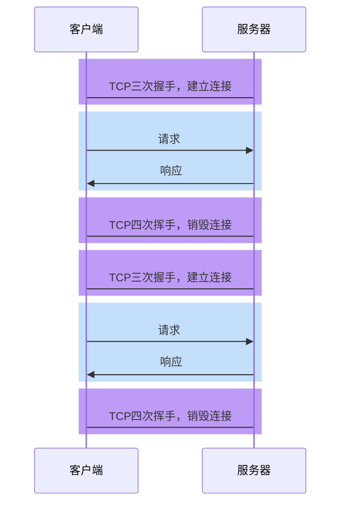
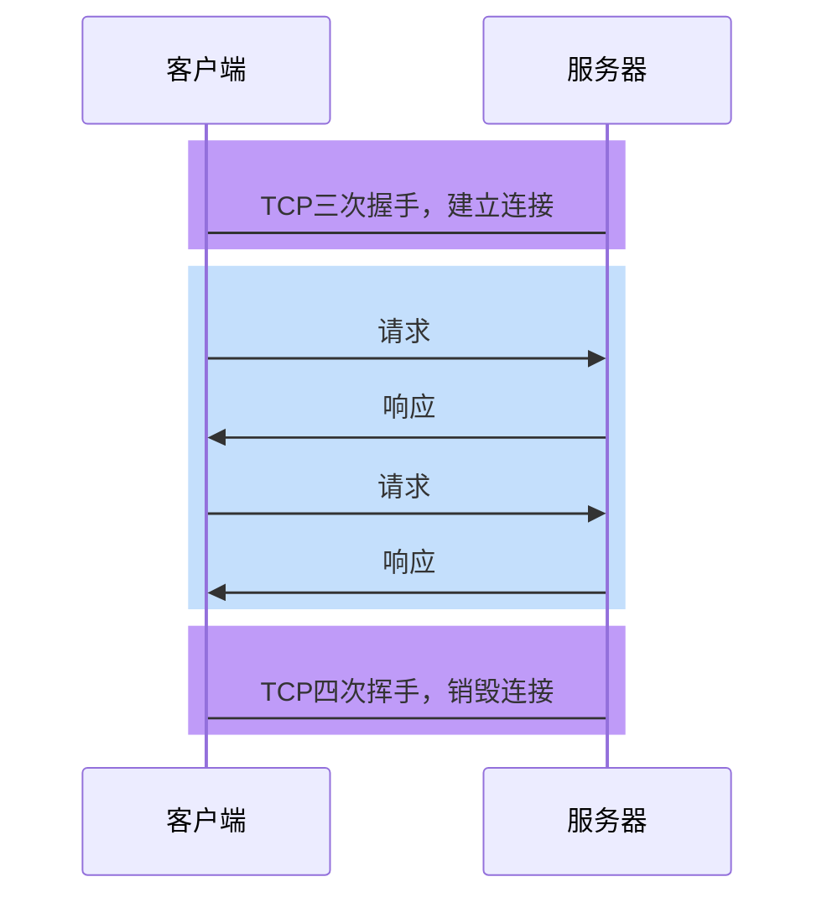

# HTTP1.0

## 无法复用连接

HTTP1.0为每个请求单独**新开一个TCP连接**

防止浪费服务器资源，因为 TCP 需要内存空间

所以有精灵图 spirit



由于每个请求都是独立的连接，因此会带来下面的问题：

1. **连接的建立和销毁**都会占用服务器和客户端的资源，造成内存资源的浪费
2. 连接的建立和销毁都会**消耗时间**，造成响应时间的浪费
3. 无法充分利用**带宽**，造成带宽资源的浪费
    
    TCP 有拥塞控制
    
    > TCP协议的特点是「**慢启动**」，即一开始传输的数据量少，一段时间之后达到传输的峰值。而上面这种做法，会导致**大量的请求在TCP达到传输峰值前就被销毁了**
    > 

## 偏客户端的队头阻塞

上一次请求结束后才能下一次请求，不能并行请求

# HTTP1.1

## 长连接

为了解决HTTP1.0的问题，**HTTP1.1默认开启长连接**，即让**同一个TCP连接服务于多个请求-响应**。



在这种情况下，多次请求响应可以共享同一个TCP连接，这不仅**减少了TCP的握手和挥手时间**，同时可以充分利用TCP「慢启动」的特点，**有效的利用带宽**。

> 实际上，在HTTP1.0后期，虽然没有官方标准，但开发者们慢慢形成了一个共识：
> 
> 
> 只要请求头中包含 **Connection: keep-alive** ，就表示客户端希望开启长连接，希望服务器响应后不要关闭TCP连接。如果服务器认可这一行为，即可保持TCP连接。
> 
> 

当需要的时候，任何一方都可以关闭TCP连接

> 扩展知识
> 
> 
> 连接关闭的情况主要有三种：
> 
> 1. 客户端在某一次请求中设置了**`Connection:close`**，服务器收到此请求后，响应结束立即关闭TCP
> 2. 在没有请求时，**客户端会不断对服务器进行心跳检测 ping**（一般每隔1秒）。一旦心跳检测停止，服务器立即关闭TCP
>     
>     Connection: keep-alive 传输层优化, heartbeat是应用层长连接
>     
> 3. 当客户端长时间**没有新的请求**到达服务器，**服务器会主动关闭TCP**。**运维**人员可以设置该时间。

由于一个TCP连接可以承载多次请求响应，并在一段时间内不会断开，因此这种连接称之为长连接。

## 管道化和偏服务器的队头阻塞

HTTP1.1允许**在响应到达之前发送下一个请求**，这样可以大幅缩减带宽限制时间

**但这样做会导致服务器队头阻塞的问题**

由于多个请求使用的是同一个TCP连接，**服务器必须按照请求到达的顺序进行响应**

因为需要请求和响应一一对应

正是由于存在队头阻塞，我们常常使用下面的手段进行优化：

- 通过**减少文件数量**，从而减少队头阻塞的几率
- 通过开辟多个TCP连接，实现真正的、有缺陷的并行传输
    
    > 浏览器会根据情况，为打开的页面自动开启TCP连接，对于同一个域名的连接最多6个
    > 
    > 
    > 如果要突破这个限制，就需要把资源放到不同的域中
    > 

**然而，管道化并非一个成功的模型，它带来的队头阻塞造成非常多的问题，所以现代浏览器默认是关闭这种模式的**

本质是因为 HTTP2 之前传输的基本单元是 **http 文档**：

行

头

体

**不能分割、不能混杂**

# HTTP2.0

## 二进制分帧

HTTP2.0可以允许以更小的单元传输数据，每个**传输单元**称之为**帧**，而每一个请求或响应的完整数据称之为**流**，每个流有自己的**编号**，每个帧会**记录所属的流**。

比如，服务器连续接到了客户端的两个请求，一个请求JS、一个请求CSS，两个文件如下：

```jsx
function a(){}
function b(){}
```

```css
.container{}
.list{}
```

最终形成的帧可能如下

可以看出，**每个帧都带了一个头部，记录了流的ID，这样做就能够准确的知道这一帧数据是属于哪个流的**。

这样就真正的解决了共享TCP连接时的队头阻塞问题，实现了真正的**多路复用**

不仅如此，由于传输时是以帧为单元传输的，无论是响应还是请求，都可以实现**并发**处理，即不同的传输可以**交替进行**。

由于进行了分帧，还可以设置传输**优先级**。

例如先响应小图，然后再响应高清图

## 头部压缩

HTTP2.0之前，所有的消息头都是以字符的形式完整传输的

可实际上，大部分头部信息都有很多的重复

为了解决这一问题，HTTP2.0**使用头部压缩来减少消息头的体积**

客户端和服务器对同一张静态表，那么到时候之需要传递一个编号即可

https://httpwg.org/specs/rfc7541.html#static.table.definition

对于两张表都没有的头部，则使用 **Huffman编码** 压缩后进行传输，同时添加到动态表中

https://github.com/ceilf6/dataStructure/blob/main/learn2code/6-%E6%A0%91/%E4%BA%8C%E5%8F%89%E6%A0%91/%E5%93%88%E5%A4%AB%E6%9B%BC%E6%A0%91/%E5%93%88%E5%A4%AB%E6%9B%BC%E6%A0%91.md

## 服务器推

HTTP2.0允许在客户端没有主动请求的情况下，服务器预先把资源推送给客户端

当客户端后续需要请求该资源时，则自动从之前推送的资源中寻找